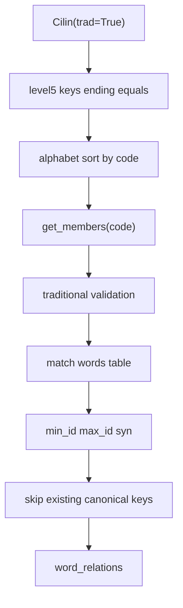

# Cilin Synonym Ingest Redesign

## Overview

Redesign Cilin synonym ingest to use only leaf-category synonym groups from `Cilin(trad=True)`, keep export/processing in Traditional Chinese, and deduplicate against canonical word pairs in the current database before writing—avoiding bidirectional duplicates and overlap with existing data.

## Design Principles

- Use the `cilin` package API as the source of truth: `Cilin(trad=True)`, avoiding manual parsing of Simplified Chinese raw files that would mix scripts.
- Treat only level-5 leaf groups whose codes end with `=` as synonym groups (e.g. `Aa01A01=`, `Ca01B01=`).
- Use `get_tag()` / category labels as metadata only—they must not become synonym relations. Do not build synonyms directly from `get_members(parent)` because parent scopes are too broad.
- Store each relation as a single undirected edge: `word_id = min(id1, id2)`, `related_id = max(id1, id2)`, `relation_type = 'syn'`.
- Deduplicate using the database’s canonical `(word_id, related_id, relation_type)` keys. Do not keep duplicate rows just because the source differs.

## Files to Update

- [`fetch_cilin_data.py`](../fetch_cilin_data.py): Export leaf synonym groups only, sorted by code, with Traditional Chinese sample assertions.
- [`ingest/syn_ant_sources.py`](../ingest/syn_ant_sources.py): Add or replace the Cilin parser to ignore category label lines and accept only the leaf code pattern.
- [`ingest/syn_ant_merge.py`](../ingest/syn_ant_merge.py): Keep canonical SQL merge, but add a streaming path that checks existing keys first and skips them to reduce unnecessary insert attempts.
- [`ingest_syn_ant.py`](../ingest_syn_ant.py): Extend `ingest-cilin` with options such as `--source-path`, `--chunk-size 300`, and `--dedupe-existing`.
- [`tests/test_syn_ant_ingest.py`](../tests/test_syn_ant_ingest.py): Add tests for leaf-only parsing, Traditional Chinese output, canonical deduplication, and bidirectional lookup.

## Cilin Code Ordering

- Stable alphabetical sort by code is sufficient; formats like `Aa01A01=` already encode hierarchy.
- Accept only leaf synonym codes matching `^[A-Z][a-z]\d{2}[A-Z]\d{2}=$`.
- Do not create synonym relations for parent/category codes such as `Aa`, `Aa01`, `A`, or `Ca01B`.

## Data Flow



## Performance / Time-Saving Strategies

- Stop generating bidirectional `n * (n - 1)` edges per group; use canonical combinations (`n choose 2`) instead.
- Filter out words not present in the `words` table within each group before generating relations that cannot be written.
- Batch-check existing keys every 300 groups or 300 candidate pairs, then insert only new keys.
- If staging is only an intermediate buffer, provide a `--direct` path that writes straight to `word_relations`, skipping millions of staging rows.
- Keep a `--staging` path for audit/debug when `syn_ant_edges` persistence is needed.

## Verification

- Confirm export line `Ca01B01=` contains `陰曆`, `舊曆`, `農曆` and does **not** contain `阴历`, `旧历`, or `农历`.
- Confirm sample codes `Aa01A01=`, `Ab02B01=`, `Dd17A02=`, `De01B02=`, `Dn03A04=` appear in sorted order and are processed as leaf groups.
- Confirm the database has no rows with `word_id > related_id`, and no duplicate `(word_id, related_id, relation_type)` tuples.
- Confirm runtime bidirectional lookup still finds synonyms when querying from either direction.

## Implementation Tasks

| ID | Task | Status |
|----|------|--------|
| `export-leaf-cilin` | Improve Cilin export: use `Cilin(trad=True)` and output sorted leaf synonym groups only. | Completed |
| `parser-leaf-only` | Adjust parser: ignore category tag lines; parse leaf code + members only. | Completed |
| `direct-dedupe-ingest` | Design/implement direct ingest: match against `words` and existing `word_relations`, then batch-write canonical pairs. | Completed |
| `tests-verify` | Add tests and verification scripts for Traditional Chinese, ordering, canonical dedupe, and bidirectional lookup. | Completed |

## Usage (Post-Implementation)

```bash
# Export Traditional leaf-only Cilin file
python fetch_cilin_data.py

# Direct ingest (default: dedupe + chunk 300)
python ingest_syn_ant.py ingest-cilin --chunk-size 300 --dedupe-existing

# Optional: custom source path
python ingest_syn_ant.py ingest-cilin --source-path path/to/new_cilin.txt

# Verify
python scripts/verify_cilin_leaf.py data/cilin/new_cilin.txt
```
